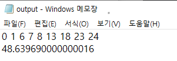
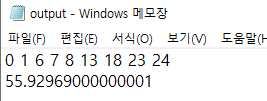
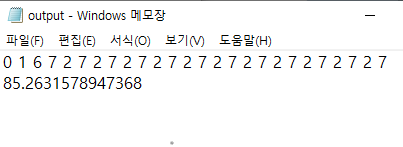

# hw2 (Q-learning with maze)

```
python3 main.py
```

## 코드

- main(): 

  - input.txt읽기

  - board 생성 (1차원 배열)

  - q_learning() 호출

    

- q_learning()

  - score판 생성 (2차원 배열, action 제약으로 사용되지 않는 곳은 계속 0으로 남아있음)

  - 10000회동안 반복하면서 학습 수행 (임의의 수)

  - choose_action()으로 다음 action을 고르고,

  - move_and_update()를 통해 action후의 위치와 score점수판을 update한다. 

  - find_path()를 통해  ouput파일 생성. 

    

- choose_action()

  - 가능한 action을 파악하는 함수

  - 우선 action을 random하게 추출한다.

  - 최우측 최좌측 최상단 최하단 점을 구분해 움직일 수 있는 방향인지 판단.

  - 없다면 다시 random하게 action 추출

  - 가능한 경우라면 action return 

    

- move_and_update()

  - q_learning에서 다음 action을 인자로 받음

  - board판에서 action수행시 움직이는 위치의 특성을 찾고, 그에 맞게 점수판을 update 및 말 위치 수정을 함. 

    

- find_path()

  - ouput.txt생성

    

## 결과 

1. reward = 1

   

2. reward = 10



3. reward = 20

   

   

